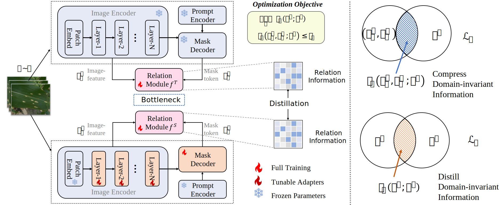

InfoSAM (ICML 2025 Spotlight)
========

By [Yuanhong Zhang](https://scholar.google.com/citations?user=IMjuhnQAAAAJ)* and [Muyao Yuan](https://muyaoyuan.github.io)* (*: Equal contribution)

* This repository is an official implementation of the paper [InfoSAM: Fine-Tuning the Segment Anything Model from An Information-Theoretic Perspective](https://to-be). 

* For a comprehensive overview, please visit the [project page](https://muyaoyuan.github.io/InfoSAM_Page).

# Introduction

**TL; DR.** InfoSAM improves SAM's performance on specialized tasks by using an information-theoretic approach to distill and preserve domain-invariant knowledge during fine-tuning.

<p align="center">

</p>

**Abstract.** The Segment Anything Model (SAM), a vision foundation model, exhibits impressive zero-shot capabilities in general tasks but struggles in specialized domains. Parameter-efficient fine-tuning (PEFT) is a promising approach to unleash the potential of SAM in novel scenarios. However, existing PEFT methods for SAM neglect the domain-invariant relations encoded in the pre-trained model. To bridge this gap, we propose InfoSAM, an information-theoretic approach that enhances SAM fine-tuning by distilling and preserving its pre-trained segmentation knowledge. Specifically, we formulate the knowledge transfer process as two novel mutual information-based objectives: (i) to compress the domain-invariant relation extracted from pre-trained SAM, excluding pseudo-invariant information as possible, and (ii) to maximize mutual information between the relational knowledge learned by the teacher (pre-trained SAM) and the student (fine-tuned model). The proposed InfoSAM establishes a robust distillation framework for PEFT of SAM. Extensive experiments across diverse benchmarks validate InfoSAM's effectiveness in improving SAM family's performance on real-world tasks, demonstrating its adaptability and superiority in handling specialized scenarios.

# Installation
We have tested the code on the following environments: 
* Python 3.8.20 / Pytorch 2.4.1 / torchvision 0.19.1 / CUDA 12.1 / Ubuntu 20.04

Run the following command to install dependencies:
```bash
pip install -r requirements.txt
```

# Prepare Dataset

Enter the `data` directory and run the following script to download the datasets.
```bash
python data_download.py
```

# Checkpoints
The model checkpoints for **InfoSAM** are available for download on Hugging Face at the following link: [InfoSAM](https://huggingface.co/MuyaoYuan/InfoSAM/tree/main).


# Evaluation

Validate on Dataset (e.g., leaf_disease_segmentation)

```bash
./config/eval/InfoSAM_b_leaf.sh --snapshot <path to checkpoints>
```

# Training

Prepare the teacher model in `ckpt` directory:
- `vit_b (default)`: [ViT-B SAM model.](https://dl.fbaipublicfiles.com/segment_anything/sam_vit_b_01ec64.pth)
- `vit_h`: [ViT-H SAM model.](https://dl.fbaipublicfiles.com/segment_anything/sam_vit_h_4b8939.pth)
- `vit_l`: [ViT-L SAM model.](https://dl.fbaipublicfiles.com/segment_anything/sam_vit_l_0b3195.pth)

Train on Dataset (e.g., leaf_disease_segmentation):
```bash
./config/train/InfoSAM_b_leaf.sh
```

# PyTorch-style Pseudocode for InfoSAM
```python
# F_t, F_s: Pre-trained SAM (teacher) and fine-tuned SAM (student)
# z_t_i, z_s_i: The output of the teacher and student image encoders
# z_t_m, z_s_m: The output tokens in mask decoder of the teacher and student 
# f_t, f_s: Teacher and student relation modules
# y_t, y_s: Teacher and student outputs
# y: Ground-truth labels
# Frob: Function for computing the square of the Frobenius norm

for x, y in loader:
    # Forward pass
    z_t_i, z_t_m, y_t = F_t(x)
    z_s_i, z_s_m, y_s = F_s(x)

    # Compute structure loss
    loss_ce = struct_loss(y_s, y)

    # Compute relations between image encoder and mask decoder
    f_s = f_t
    r_t = f_t(z_t_i, z_t_m)
    r_s = f_t(z_s_i, z_s_m)

    # Normalize the representations
    z_t_i_norm = F.normalize(z_t_i, p=2)
    z_t_m_norm = F.normalize(z_t_m, p=2)
    
    # Compute normalized Gram matrices for compression loss_r
    G_t_i = matmul(z_t_i_norm, z_t_i_norm.T)
    G_t_m = matmul(z_t_m_norm, z_t_m_norm.T)
    G_t_f = matmul(r_t, r_t.T)
    G_t_f_norm = G_t_f / trace(G_t_f)
    G_t_imr_norm = G_t_i * G_t_m * G_t_f / trace(G_t_i * G_t_m * G_t_f) 

    # Compute normalized Gram matrices for distillation loss_d
    G_s_f = matmul(r_s, r_s.T)
    G_s_f_norm = G_s_f / trace(G_s_f)
    G_ts_f_norm = G_s_f * G_t_f / trace(G_s_f * G_t_f)

    # Compute relation compression loss_r and distillation loss_d
    loss_r = - log2(Frob(G_t_f_norm)) + log2(Frob(G_t_imr_norm))
    loss_d = log2(Frob(G_t_f_norm)) + log2(Frob(G_s_f_norm)) - log2(Frob(G_ts_f_norm))
    loss_info = lamda_1 * loss_r + lamda_2 * loss_d

    # The overall loss
    loss = loss_ce + loss_info

    # Optimization step
    loss.backward()
    optimizer.step()
```

# Citation
If you find InfoSAM useful in your research, please consider citing:
```bibtex
To-be
```

# Acknowledgement
* The code and some instructions are built upon the official [Segment Anything Model repository](https://github.com/facebookresearch/segment-anything)
* The datasets are sourced from the official [Conv-LoRA repository](https://github.com/autogluon/autogluon/tree/master/examples/automm/Conv-LoRA)


# License

This project is released under the [Apache 2.0 license](./LICENSE).
Copyright 2025 InfoSAM Authors. All Rights Reserved.